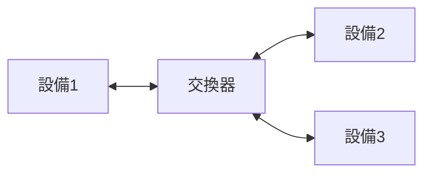

用於連接區域網中的多個設備，並根據MAC地址轉發數據幀。它在數據鏈路層工作。

**參考資料**：[wikipedia：Switch](https://en.wikipedia.org/wiki/Network_switch)

---
## 功能
- **設備連接**：將多台設備連接到同一網絡。
- **數據轉發**：根據MAC地址將數據幀轉發到正確的端口。

---
## 工作流程

---