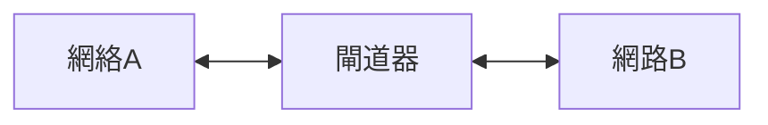

閘道器在不同網絡之間進行數據轉換和傳輸。當數據包從一個網絡發送到另一個網絡時，閘道器會根據協議進行轉換，以確保數據能夠被目標網絡理解和處理。

**參考資料**： [wikipedia：Gateway](https://en.wikipedia.org/wiki/Gateway_(telecommunications))

---
## 功能
- **協議轉換**：在不同網絡協議之間進行轉換（如 IPv4 到 IPv6）。
- **連結不同網路**：連結不同網路並實現它們之間的通訊。

---
## 工作流程

---

