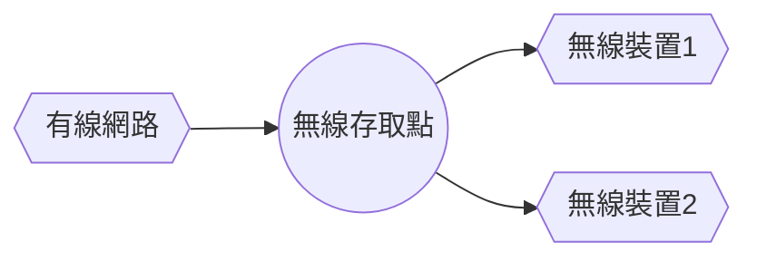

提供無線連接，使無線設備能夠連接到有線網絡（Wi-Fi 發射器）。

**參考資料**：[wikipedia：Structured cabling](https://en.wikipedia.org/wiki/Wireless_access_point)

---
## 功能
- **無線連接**：提供Wi-Fi信號，使無線設備能夠連接到網絡。

---
## 工作流程

```mermaid
flowchart LR;
A{{有線網路}} --> B((無線存取點))
B-->C{{無線裝置1}}
B-->D{{無線裝置2}}

```

---