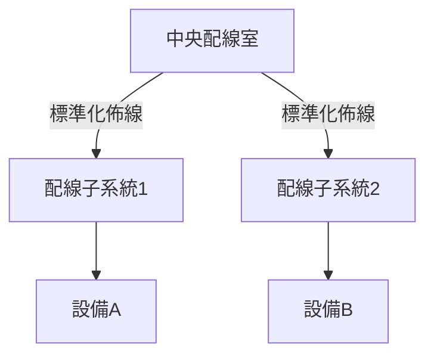

結構化佈線是一種標準化的佈線系統，用於支持多種硬體設備和通信協議的綜合佈線解決方案。

**參考資料**：[wikipedia：Structured cabling](https://en.wikipedia.org/wiki/Structured_cabling)

---
## 功能
- **標準化佈線**：定義標準化的電纜、連接器和佈線方法，確保兼容性和靈活性。

---
## 工作流程

---