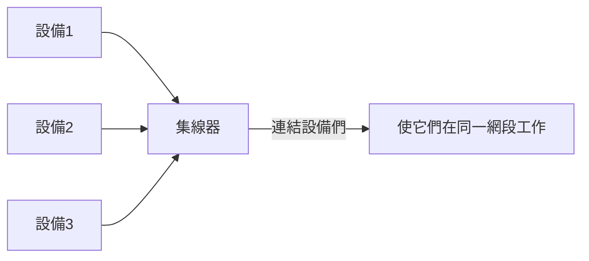

連接多個**乙太網路**設備再一起，並使它們在單一網段工作。

**參考資料**：[wikipedia：Ethernet_hub](https://en.wikipedia.org/wiki/Ethernet_hub)

---
## 功能
- **設備連接**：將多台設備連接到同一網絡。
- **數據轉發**：根據MAC地址將數據幀轉發到正確的端口。

---
## 工作流程

```mermaid
graph LR;
  A[設備1] --> B[集線器]
  C[設備2] --> B
  D[設備3] --> B
  B --> |連結設備們|E[使它們在同一網段工作]
```

---