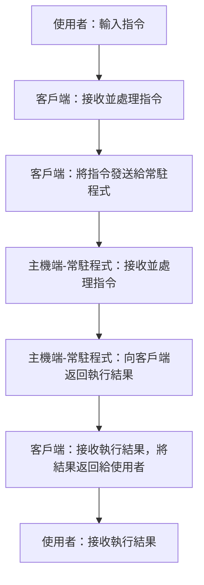
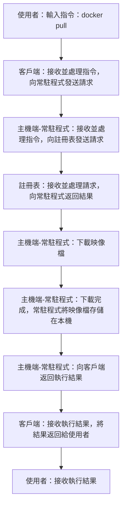
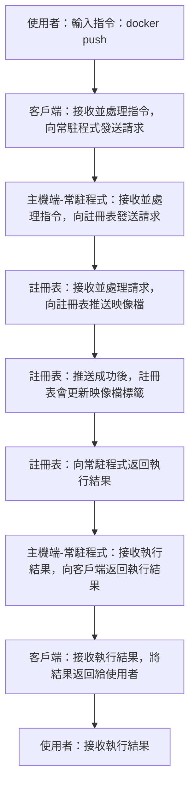

**建立日期＆時間：2025／01／25 03：26**
# Docker 系統架構圖
---

## Docker 系統核心
**一 . 用戶端（Client）**
**二 . 主機端（Docker Host）**
**三 . 註冊表（Registry）**

# Docker 核心
---
#### Docker  客戶端（Docker Client）
**說明：**
1. 使用者 與 Docker 溝通的主要介面。
2. 使用者發送 Docker 指令，透過客戶端發送指令給常駐程式。

**客戶端功能**
1. **接收使用者指令：** 使用者輸入Docker 指令。 客戶端補充資料１
2. **解析並處裡指令：** 客戶端解析使用者指令，生成相應的 Docker API 客戶端補充資料２請求。
3. **向常駐程式發送請求：** 將生成的 Docker API 客戶端補充資料２请求，發送給常駐程式。

**客戶端補充：**
1. **Docker CLI 工具（Docker CLI、Compose CLI、Daemon CLI 或 dockerd）**

| **CLI 工具** | **主要用途** | **適用場景** |
| :-----| :---- | :---- |
| **Docker CLI** | 管理 Docker 資源（映像檔、容器、網路等） | 單一容器管理、基本 Docker 環境操作 |
| **Compose CLI** | 定義和運行多容器應用程式 | 管理多容器應用程式 |
| **Daemon CLI 或 dockerd** | 設定和管理 Docker Daemon 本身 | 設定 Docker Daemon 的運行參數 |

2. **Docker API 工具（Engine API、Docker Hub API、DVP Data API）**

| **API 工具** | **主要用途** | **適用場景** |
| :-----| :---- | :---- |
| **Engine API** | 以程式化的方式存取 Docker Daemon，管理 Docker 資源（容器、映像檔、網路等） | 自動化部署、持續整合、客製化 Docker 管理工具 |
| **Docker Hub API** | 以程式化的方式與 Docker Hub 互動，管理 Docker Hub 上的映像檔 | 自動化管理 Docker 映像檔、持續整合、客製化 Docker 映像檔管理工具 |
| **DVP Data API** | 讓 Docker 驗證發布者取得分析數據，追蹤他們在 Docker Hub 上的映像檔使用情況 | Docker 驗證發布者分析他們的映像檔使用情況 |

**客戶端補充資料：**
- **CLI 介紹：** 補充資料 --> 7. CLI 補充資料
- **Docker CLI 工具：** 補充資料 --> 8. Docker CLI 指令
- **API 介紹：** 補充資料 --> 9. API 補充資料
- **Docker API 工具：** 補充資料 --> 10. API CLI 工具

#### Docker 主機端（Docker Host）
**說明：**
1. **管理容器和映像檔：** 提供容器的執行環境並儲存映像檔。
2. **接收及執行 Docker API 請求：** 常駐程式接收並執行 API 請求。

**Docker 主機端功能**
1. **Docker 常駐程式（核心服務）：**
	- **接收：** 接收從**客戶端** 發送的 **Docker API** 請求。 
	- **執行：**  執行 **Docker API** 請求，來操作 Docker 如映像檔、容器以及網路等）
2. **映象檔：**
	- **儲存位置：** 從**註冊表**取得映像檔會儲存在此（Docker 主機端）。
3. **容器：** 與 **基礎：Docker三大元件** 容器作用與功能相同。

#### 註冊表（Registry）
**說明：** 註冊表是一個用於存放和管理映像檔的服務，與倉庫功能類似。

**註冊表與倉庫主要==差異==**

| **特性** | 註冊表| 倉庫 |
| :-----| :---- | :---- |
| **定義** | 一個伺服器應用，用來託管和分發倉庫 | 儲存和管理 Docker 映像檔的集合 |
| **內容**| 包含多個倉庫，每個倉庫由映像檔構成 | 包含多個映像檔，想同名稱的映像檔案用標籤做版本區分 |
| **功能** | 儲存、分發、部署映像檔 | 管理具有相同名稱的映像檔的不同版本 |
| **層級關西** | 是一個實體服務 | 存在於註冊表之中 |
| **舉例** | Git 的伺服器託管和管理多個倉庫 | Git 的倉庫儲存代碼的版本 |
| **操作** | 從中拉取或推送映像檔 | 使用標籤管理映像檔的不同版本 |

**總結**
	- **註冊表**是一個更高層級的服務，用於儲存和管理 Docker 映像檔。它就像一個大型的線上圖書館，裡面儲存了各種 Docker 映像檔。
	- **倉庫**則是**註冊表**內的一個命名空間，用於儲存具有相同名稱的映像檔的不同版本。它就像圖書館中的書架，上面擺放著同一本書的不同版本。

# Docker系統運作流程
#### Docker 指令流程

#### `docker pull` 指令流程

#### `docker push` 指令流程

## 補充資料
1. **REST API：**  補充資料／ Docker 系統核心相關／補充２
2. **UNIX 套接字：** 補充資料／ Docker 系統核心相關／補充1
3. **Docker 應用程式（Docker Desktop）**
4. **永久性儲存 （Persistent Storage）**
5. **分發（distribution）：**
	- 將映像檔、擴展和插件從一個中心來源（如Registry）傳輸到不同的目標環境（如 Docker 主機）。
	- 這個過程允許多個環境快速獲取所需的軟體組件，從而實現一致性和高效的部署。
6. **Docker Compose*：*
	 - Docker Compose 是一個工具，用於定義和運行多容器的Docker應用程序。透過使用一個YAML文件，你可以配置應用程序的服務，並使用一個簡單的指令來啟動所有的服務。
	- Docker Compose 可幫助你更便捷地管理和協調多個相互依賴的容器。
7. **CLI 補充資料：** 補充資料 --> 補充３：CLI（命令行介面）
8. **Docker CLI 指令：** 
	- **Docker CLI：** [官方文檔－Docker CLI](https://docs.docker.com/reference/cli/docker/ "游標顯示")
	- **Compose CLI：** [官方文檔－Compose CLI](https://docs.docker.com/reference/cli/docker/compose/ "游標顯示")
	- **Daemon CLI：** [官方文檔－Daemon CLI](https://docs.docker.com/reference/cli/dockerd/ "游標顯示")
9. **API 補充資料：** 補充資料 --> 補充４：API（應用程式介面）
10. **Docker API 工具：**
	- **Engine API：** [官方文檔－Engine API](https://docs.docker.com/reference/api/engine/ "游標顯示")
	- **Docker Hub API：** [官方文檔－Docker Hub API](https://docs.docker.com/reference/api/hub/latest/ "游標顯示")
	- **DVP Data API：** [官方文檔－DVP Data API](https://docs.docker.com/reference/api/hub/dvp/ "游標顯示")